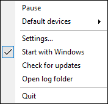
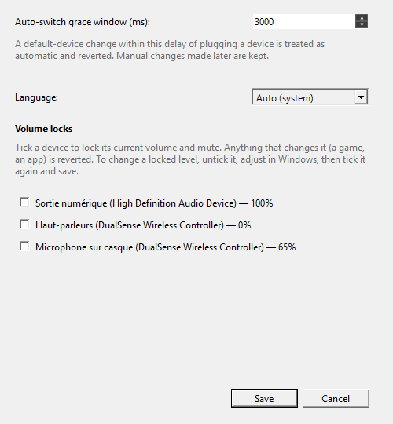

# AudioWinFix

[English](README.md)

Une petite app Windows en barre d'état qui **épingle vos appareils audio par
défaut** — lecture, micro et communication — pour que Windows arrête de les
changer dès que vous branchez un casque, un écran, une station d'accueil ou un
DAC USB. Vous pouvez toujours switcher manuellement quand vous voulez ;
AudioWinFix ne combat que les changements *automatiques*.

## Pourquoi

Windows adore promouvoir tout seul un appareil fraîchement branché en « défaut ».
Les solutions existantes ne savent pas distinguer un changement automatique d'un
changement volontaire (elles annulent donc *tout*), ou bien ce sont des outils
en ligne de commande fermés greffés au Planificateur de tâches. AudioWinFix fait
une seule chose, de façon invisible.

## Fonctionnement

AudioWinFix surveille les changements d'appareil par défaut et les
branchements/débranchements. Quand le défaut change :

- **Juste après un branchement/débranchement** (dans une courte fenêtre de grâce
  réglable) → c'est considéré comme un changement automatique et **annulé** au
  profit de votre appareil épinglé.
- **Tout seul, sans branchement récent** → c'est considéré comme un changement
  **manuel** et **adopté** silencieusement comme nouvel épinglage.

Donc switcher via les paramètres Son de Windows fonctionne normalement — ça
devient votre nouvel appareil épinglé. Seuls les changements non sollicités de
Windows sont annulés.

Les trois rôles de défaut de Windows (Console, Multimédia, Communications) sont
suivis, pour la lecture comme pour la capture.

## Installation

1. Téléchargez `AudioWinFix-win-Setup.exe` depuis la
   [dernière release](https://github.com/Kenshin9977/AudioWinFix/releases/latest).
2. Lancez-le. Il s'installe dans `%LocalAppData%\AudioWinFix` (aucun droit admin)
   et démarre dans la barre d'état. Les mises à jour sont automatiques (Velopack).

Les binaires sont signés Authenticode (Certum, horodatés).

## Captures

Le menu du tray et le sélecteur d'appareil par défaut — définis ta sortie /
ton micro par défaut (et leurs variantes communication) directement depuis le
tray :

 &nbsp; 

Paramètres — la fenêtre anti-bascule, la langue, et les verrous de volume par
appareil :



## Utilisation

AudioWinFix n'a pas de fenêtre — il vit dans la barre d'état. Clic droit sur
l'icône :

- **Pause / Reprendre** — arrêter d'annuler temporairement (switches et volumes
  libres en pause ; l'épinglage suit ce sur quoi vous restez).
- **Appareils par défaut** — définir l'appareil par défaut / de communication par
  défaut pour la sortie et le micro directement depuis le tray, sans fouiller les
  menus Windows. Votre choix devient le nouvel épinglage.
- **Paramètres…** — la **fenêtre de grâce** (ms), la **langue** (Auto / English /
  Français) et les **verrous de volume** (voir ci-dessous).
- **Démarrer avec Windows** — démarrage automatique par utilisateur (sans admin).
- **Rechercher des mises à jour**, **Ouvrir le dossier des journaux**, **Quitter**.

L'info-bulle liste les appareils actuellement épinglés.

### Verrous de volume

Windows (et certains jeux — Black Ops 3 est connu pour remettre le niveau du
micro) adorent changer le volume tout seuls. Dans **Paramètres → Volumes
verrouillés**, coche un appareil pour figer son volume et son état muet actuels ;
tout ce qui les modifie est annulé. Contrairement au changement d'appareil, le
volume **ne peut pas** être auto-classé volontaire vs involontaire — aucun signal
ne permet de distinguer un jeu de toi — donc le verrou est explicite : pour
changer un niveau verrouillé, décoche, ajuste dans Windows, recoche, enregistre.
La pause (tray) relâche tous les verrous temporairement.

### La fenêtre de grâce

Par défaut **3000 ms**. Un changement de défaut survenant dans ce délai après un
branchement/débranchement est jugé automatique et annulé ; un changement
ultérieur est conservé. Baissez-la si votre machine bascule vite et que vous
voulez qu'un switch manuel juste après un branchement soit gardé ; augmentez-la
si des bascules automatiques passent au travers.

## Fichiers

- Épinglages : `%AppData%\AudioWinFix\pins.json`
- Paramètres : `%LocalAppData%\AudioWinFix\settings.json` (écrit par la fenêtre
  Paramètres)
- Journaux : `%LocalAppData%\AudioWinFix\logs\` (rotation quotidienne)

## Compiler depuis les sources

```bash
git clone https://github.com/Kenshin9977/AudioWinFix
cd AudioWinFix
dotnet build AudioWinFix.slnx -c Release
dotnet test AudioWinFix.slnx -c Release
# Installeur autonome en fichier unique :
pwsh build/publish.ps1 -Pack -PackVersion 0.1.0
```

Nécessite le SDK .NET 10 (Windows). `AudioWinFix.Core` cible `net10.0-windows`
car il utilise l'API CoreAudio de Windows ; il ne compile et ne se teste donc
que sous Windows.

## Structure

```
src/
  AudioWinFix.App/    App WinForms en barre d'état (entrée, UI, paramètres, hosting)
  AudioWinFix.Core/   Bibliothèque sans UI
    Audio/            AudioMonitor, l'heuristique de switch, interop IPolicyConfig,
                      stockage des épinglages
tests/
  AudioWinFix.Core.Tests/   Tests xUnit (heuristique + persistance des épinglages)
```

## Techno

- **NAudio** — énumération CoreAudio et notifications de changement de défaut.
- **IPolicyConfig** (interop COM) — définit l'appareil par défaut par rôle, la
  même interface que le panneau de configuration Son.
- **Velopack** — installeur + mise à jour automatique. **Serilog** — journaux.
